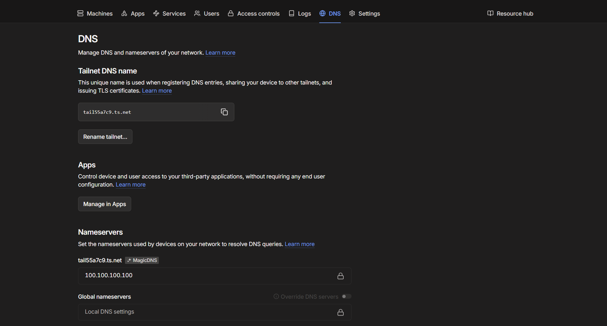
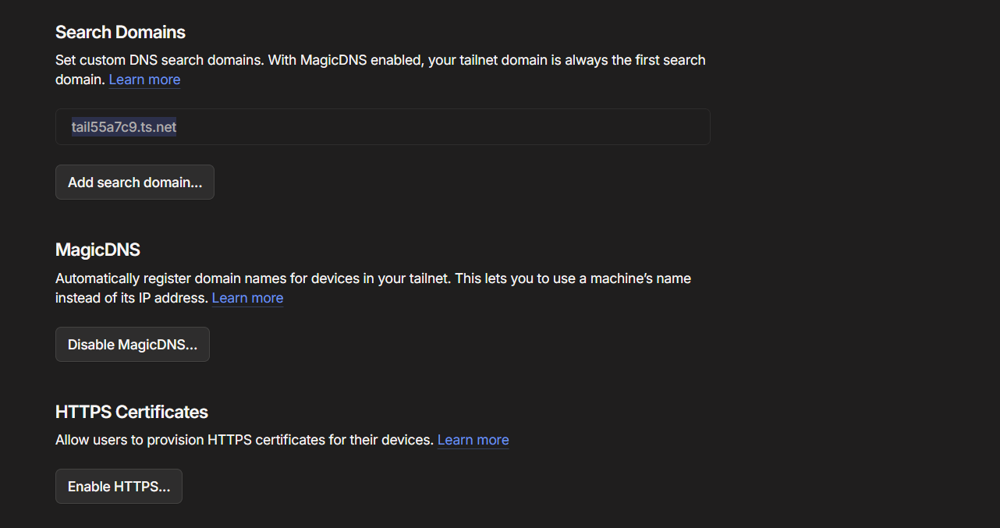

<h1>Mobile</h1>

You can connect the mobile app to the server component from the connection screen as shown below

 You should enter the url that will connect you to your server component on your tailscale network. This will be the name of the device running the server component on the tailscale network followed by a "." followed by the DNS name of the tailscale network. You should also put the username and password you entered into the "File_server" component on the server component. 

The names of the machines on your tailscale network can be found on this menu

The DNS name of the tailscale network is the text that appears in the "Tailnet DNS name" box

After these details have been submitted you will notice features that require the server component can access data

<h1>Desktop</h1>
<h4>Tailscale configuration</h4>

Firstly log into tailscale and go onto the DNS settings as shown below

Next go scroll down to go to the Magic DNS menu as shown below

Here you should enable magic DNS if it's not enabled already and enable HTTPS

