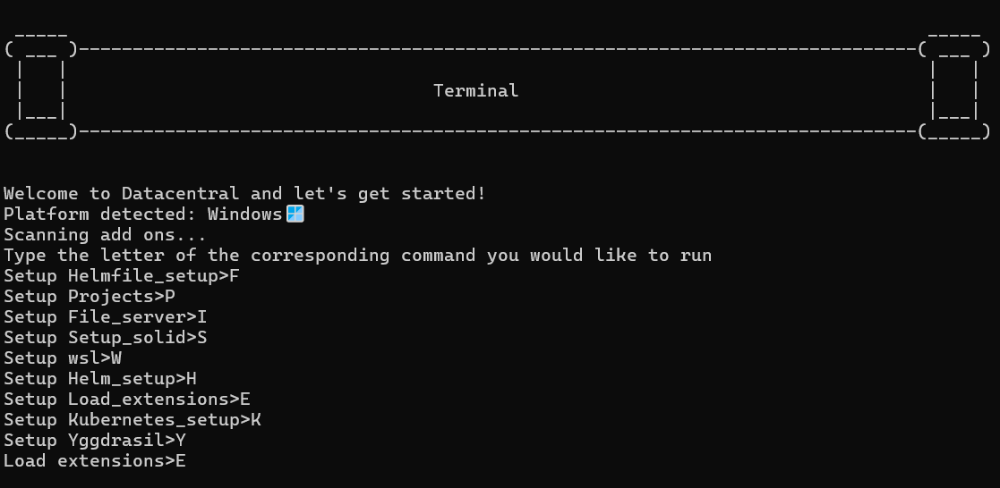

<h1>Start</h1>

To start using the server component simply: 

<ol>
  <li>Clone this repo/download the files</li>
  <li>Run "main.exe" <-- Other files are add ons that can be installed from this file (It acts as a sort of package manager)</li>
</ol>

However many of the add ons are legacy add ons so in order to use them extra steps are required as shown below: 

  <ol>
    <li>Clone this repo/download the files </li>
    <li>Download the add ons from <a href="https://drive.google.com/drive/folders/1cJYGMm6Aftqti8qN181DWwTC-rRK3Q2z?usp=drive_link">here</a> into the same directory as these files (legacy)</li>
    <li>Download the file <a href=https://drive.google.com/drive/folders/1FH03lHsV1SscCKU3DQOyHyDsb654SCWD?usp=sharing">"datacentral-1.0.0 Setup.exe"</a> into the same directory as the other files</li>
    <li>Run "Server.exe"</li>
    <li>Run the "datacentral-1.0.0 Setup.exe" file by clicking on it twice to open the GUI interface</li>
    <li>Choose "Configure network" if you wish to run datacentral on that computer or you can run Server.exe on one computer and run the GUI on another computer using "Connect to network"</li>
    <li>Create an account at localhost:3000 and create a pod called "poddy" to use the solid based add ons</li>
  </ol> 
<h1>Add ons guide</h1>

When you run main.exe you should see this menu

(Note: If you want to add addons you can just upload the exe to the same directory as main.exe then update Addon_keybinds.json)

<h2>File server</h2>

The file server is the most important addon because it's the addon that connects the server component to the mobile app. To run it simply type "I" and press enter. You will then need to wait for it to start the file server. You will then need to input two directories. One directory to be accessed by your mobile app for downloading files (Download directory) and one directory to upload files to from your mobile app (Upload directory) (these can be the same directory). You will also need to enter a username and a password. Once the file server is running you can connect to it from the mobile app as demonstrated in the connections guide. 

