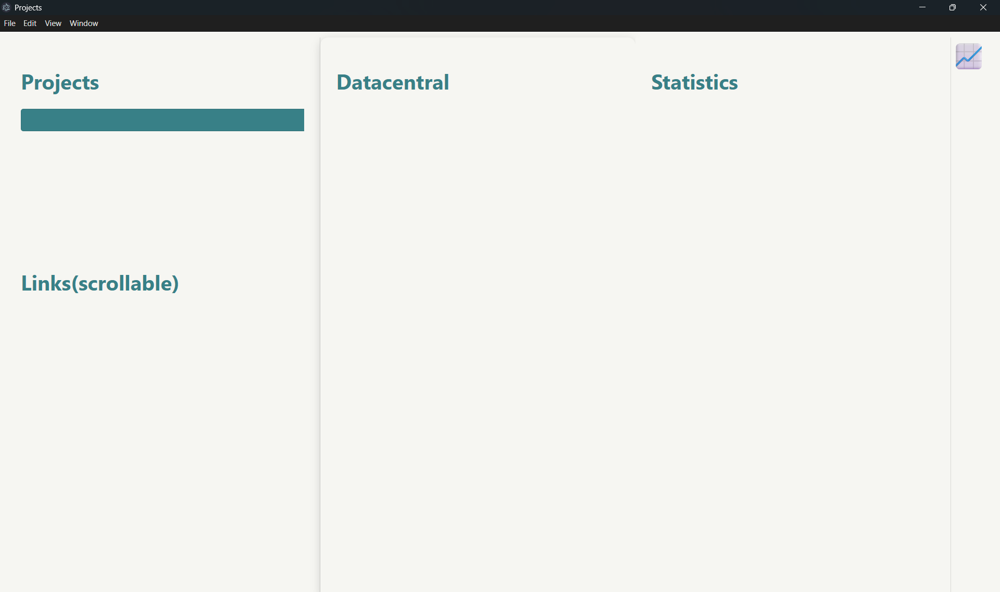
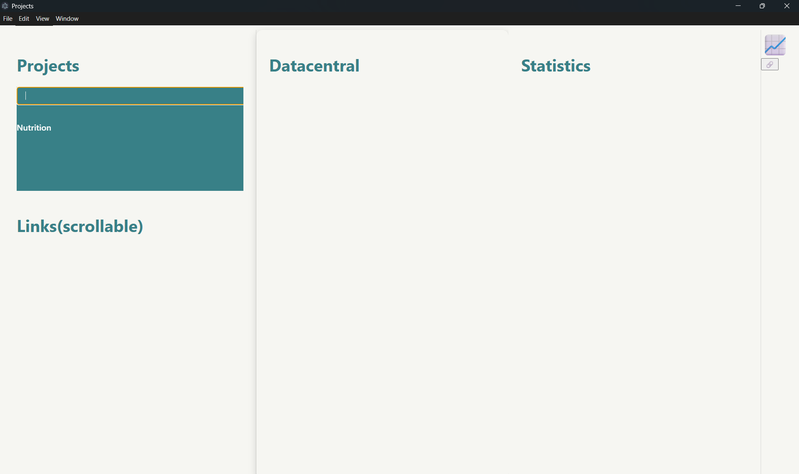
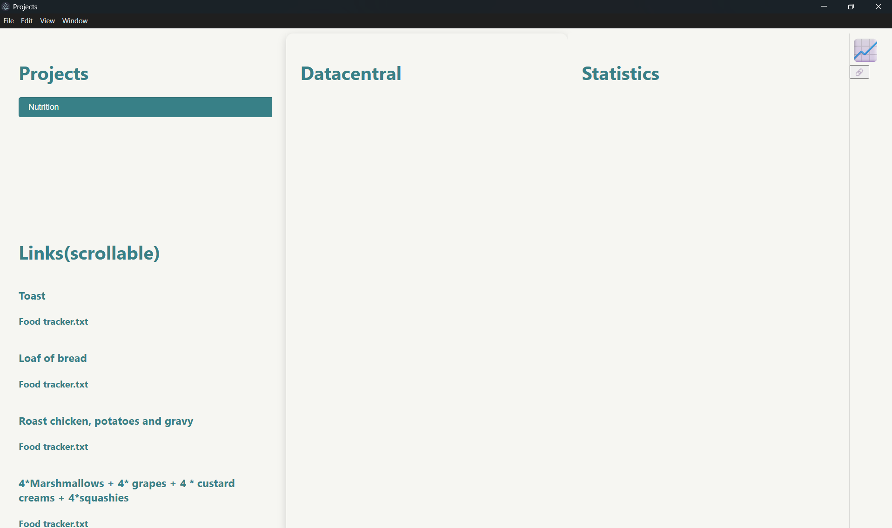
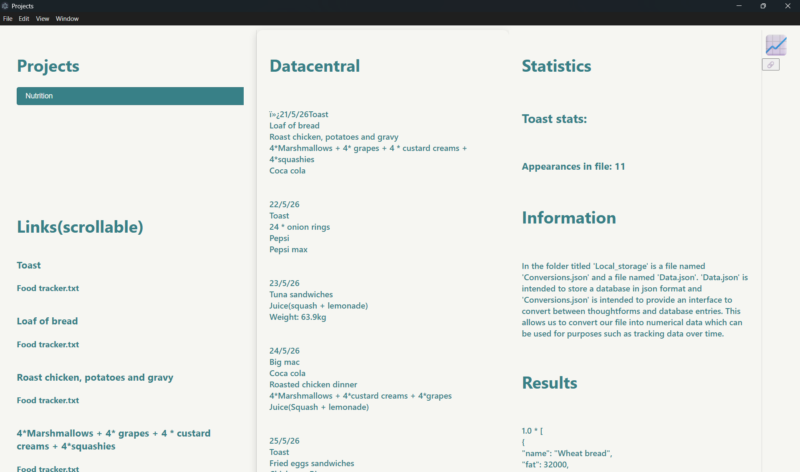
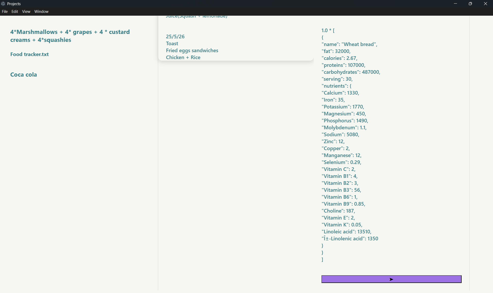
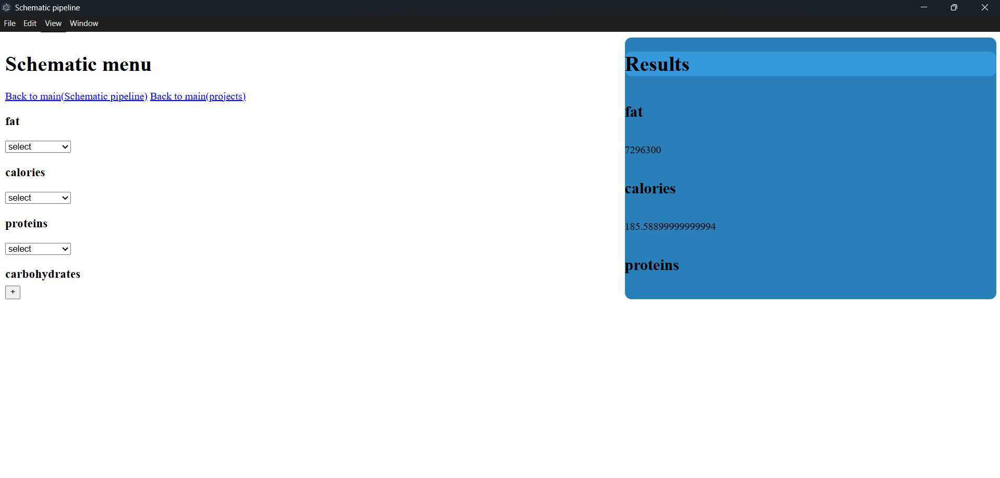
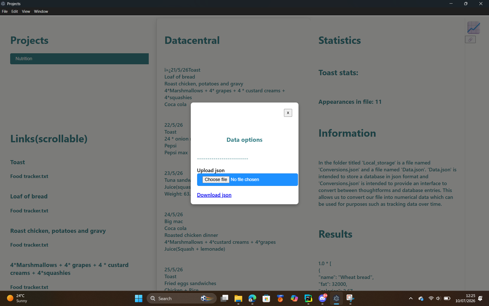

<h1><a href="./README.md">Back to main</a></h1>
<h1>Start</h1>

To start using the server component simply: 

<ol>
  <li>Clone this repo/download the files</li>
  <li>Run "main.exe" <-- Other files are add ons that can be installed from this file (It acts as a sort of package manager)</li>
</ol>

However many of the add ons are legacy <a href="https://datacentral-creator.github.io/Datacentral_implementations/Add_ons">add ons</a> so in order to use them extra steps are required as shown below: 

  <ol>
    <li>Clone this repo/download the files </li>
    <li>Download the <a href="https://datacentral-creator.github.io/Datacentral_implementations/Add_ons">add ons</a> from <a href="https://drive.google.com/drive/folders/1cJYGMm6Aftqti8qN181DWwTC-rRK3Q2z?usp=drive_link">here</a> into the same directory as these files (legacy)</li>
    <li>Download the file <a href=https://drive.google.com/drive/folders/1FH03lHsV1SscCKU3DQOyHyDsb654SCWD?usp=sharing">"datacentral-1.0.0 Setup.exe"</a> into the same directory as the other files</li>
    <li>Run "Server.exe"</li>
    <li>Run the "datacentral-1.0.0 Setup.exe" file by clicking on it twice to open the GUI interface</li>
    <li>Choose "Configure network" if you wish to run datacentral on that computer or you can run Server.exe on one computer and run the GUI on another computer using "Connect to network"</li>
    <li>Create an account at localhost:3000 and create a pod called "poddy" to use the solid based add ons</li>
  </ol> 
<h1>Add ons guide</h1>

When you run main.exe you should see this menu

(Note: If you want to add <a href="https://datacentral-creator.github.io/Datacentral_implementations/Add_ons">add ons</a> you can just upload the exe to the same directory as main.exe then update Addon_keybinds.json)

<h2>File server</h2>

The file server is the most important <a href="https://datacentral-creator.github.io/Datacentral_implementations/Add_ons">add on</a> because it's the <a href="https://datacentral-creator.github.io/Datacentral_implementations/Add_ons">add on</a> that connects the server component to the mobile app. To run it simply type "I" and press enter. You will then need to wait for it to start the file server. You will then need to input two directories. One directory to be accessed by your mobile app for downloading files (Download directory) and one directory to upload files to from your mobile app (Upload directory) (these can be the same directory). You will also need to enter a username and a password. Once the file server is running you can connect to it from the mobile app as demonstrated in the connections guide. 

<h2>Projects</h2>

The projects <a href="https://datacentral-creator.github.io/Datacentral_implementations/Add_ons">add on</a> let's you view your projects. These are currently created using the mobile app and sent to your computer, where they can be sent back to other mobile apps (or the same mobile app) however you can interact with project information using the project <a href="https://datacentral-creator.github.io/Datacentral_implementations/Add_ons">add on</a> on the server component. To use it press type "P" then press enter and wait for the project <a href="https://datacentral-creator.github.io/Datacentral_implementations/Add_ons">add on</a> to activate.It also comes with a GUI with additional features which you can download from <a href="https://drive.google.com/drive/folders/1FH03lHsV1SscCKU3DQOyHyDsb654SCWD?usp=sharing">here</a>

To use the projects addon, open the GUI. You will see a menu on your left with a search bar with autocomplete features. This lets you search for a project from the list of projects conveniently.Once you have selected a project the links will fill up with the links of that project (beware this is a scrollable menu).You can click on the source parameter of a link to open that source file (as longa as the file is in the Local_storage folder) and it will tell you how often the link appears in the source file. From here comes the main functionality. There are three json files - Data.json,Schematic.json and Conversions.json. Data.json is a database in json format.You can upload and download this through a user interface. Conversions.json is a json file that holds a set of conversions between links and the datbase entries.You can create this through the "Create conversion" interface.The schematic.json file contains data for a schematic - this lets you choose how you want to interact with the parameters of the database entry. Right now you can choose to add all entries of the same parameter and "search" which allows you to link database entries (you can also add up these nested parameters). To see the results of this you can press the button on the right of the GUI that looks like a graph. This takes you to a menu where you can define the schematic and see the results of the data in the source file.

 

Project add on home page
 
     

Searchbar menu with autocomplete
 
  

Links from an example project I created(Nutrition)
 
  

Menu after clicking a link
 
  

You can click this button to store the results for further proccessing
 
  

This is an example of the results after further proccessing. You can also define schematics on this page (which creates the Schematic.json file for you determining how the results are proccessed). You can also save the processed result as an "event" which saves the data along with a date and time. 
 
  

This is the menu for uploading and downloading databases via a JSON file (Data.json) as well as creating conversions which allow the program to convert references into database entries for analysis.

