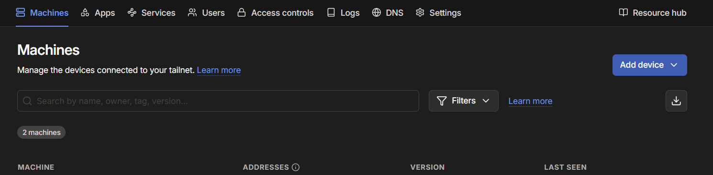
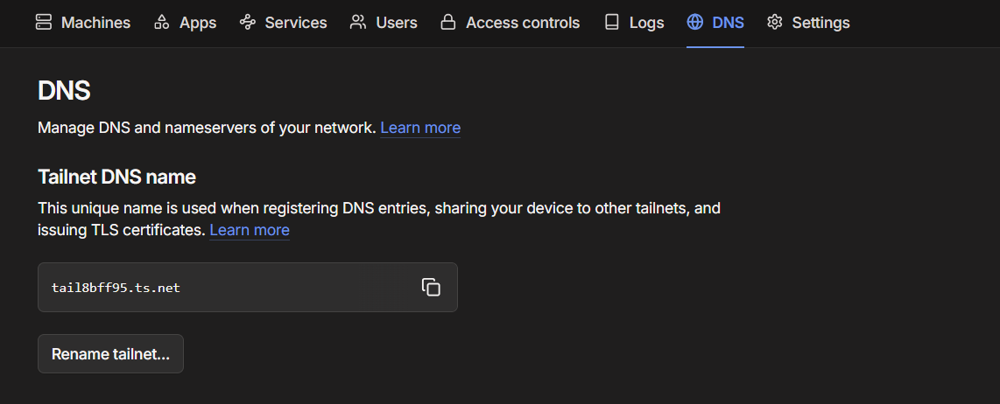

<h1>Datacentral</h1>

  Datacentral is a personal knowledge system that lets you collect, organise, and explore your files in a more meaningful way. It breaks large documents into manageable chunks, highlights the key concepts inside them (“thoughtforms”), and lets you link related ideas together into projects you can navigate like a network. Datacentral is split into two components:
  <ol>
    <li>Mobile app</li>
    <li>Server component (desktop)</li>
  </ol>

<h2><a href="./Desktop_user_manual.md">Desktop</a></h2>
<h3>Quickstart</h3>
<ol>
  <li>Clone this repo/download the files</li>
  <li>Run "main.exe" <-- Other files are add ons that can be installed from this file (It acts as a sort of package manager)</li>
</ol>
<h2>Mobile</h2>
<ol>
    <li>Download the app from <a href=https://drive.google.com/drive/folders/1ybxwCeh7UPWqyliDBnq135hPyD_FrkKH?usp=sharing>here</a></li>
    <li>Run the app</li>
</ol> 
<h3>If you want to connect it to the server component</h3>
<ol>
  <li>Install tailscale on your phone</li>
  <li>Sign in to the same network on your computer</li>
</ol>
<h1>Using the app</h1>
    

This is the home page which you will see when first opening the app

The first thing you should do is click the settings button which is the button at the bottom of the screen that looks like a cog or wheel

That should take you to this page

With magma theme

With emerald theme

Here, if you plan to connect the mobile app to the server component you should enter the url that will connect you to your server component on your tailscale network. This will be the name of the device running the server component on the tailscale network followed by a "." followed by the DNS name of the tailscale network. You should also put the username and password you entered into the "File_server" component on the server component. 

The names of the machines on your tailscale network can be found on this menu

The DNS name of the tailscale network is the text that appears in the "Tailnet DNS name" box

I would also strongly reccomend clicking a theme from "Deep obisidan and magma" or "Bright emerald" by clicking on the theme you wish to pick

Your changes will be initialised when you refresh the page by clicking on the settings button again or when you return to the home page

You can now return to the home page by clicking on the editor button which is the button that resembles a hand holding a pen at the bottom of the screen

This is what the home page will now look like:

Magma

Emerald

You can upload files either by clicking the "upload" button and uploading files from your phone, or waiting and the "Server directory" files menu will become populated with the files from the file server on the server component, clicking on one of these files will download it into your local files on the app (as well as uploading a file from your phone) 

You can click on a local file to interact with it

The screen below is a demonstration of this with an example file

The file loads in chunks. Everything you see on this page is one chunk. You can navigate the chunks using the arrows. You can also edit chunks freely however currently saving an edited chunk results in it being saved as it's own file (in the local files).

You will see on the side a menu saying "thoughtforms". Thoughtforms in the text files are symbols of sorts. They are the words the text is based around. The thoughtforms in the document you are editing are highlighted yellow by default. You can also filter thoughtforms by pressing the settings button in the thoughtform menu to filter the minimum length you will allow a thoughtform to be as shown below. 

Thoughtforms are also useful because of the button "create links from selected thoughtforms". All thoughtforms are selected by default but you can unselect thoughtforms that aren't useful or deselect all thoughtforms and just select the ones you want then turn these thoughtforms into links. 

If you pull out the slideable menu,returning to the home page you will see a "projects" section

Projects are collections of links. You can click on a project then click on a link inside of it and it will navigate to the file that link is from (opening that file in the editor).

You can create projects by clicking the "+" button in the top right of the projects menu. You then click on it to add links to it. You can also send projects to the server component or import projects from the server component. This will exchange the metadata of the project, links in the project and the files the links are attatched to.

Further reading(research/theoretical grounding): https://datacentral-creator.github.io/

