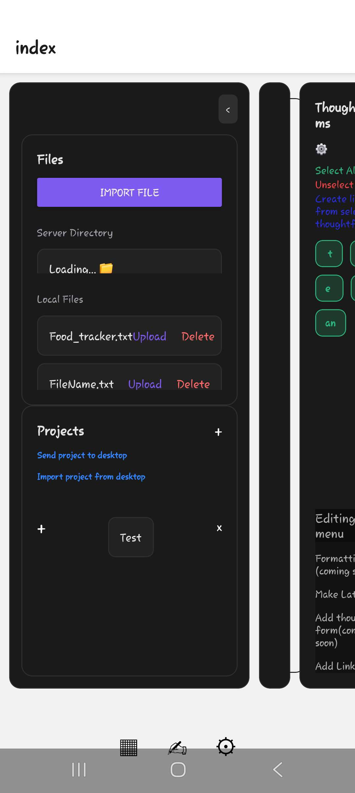
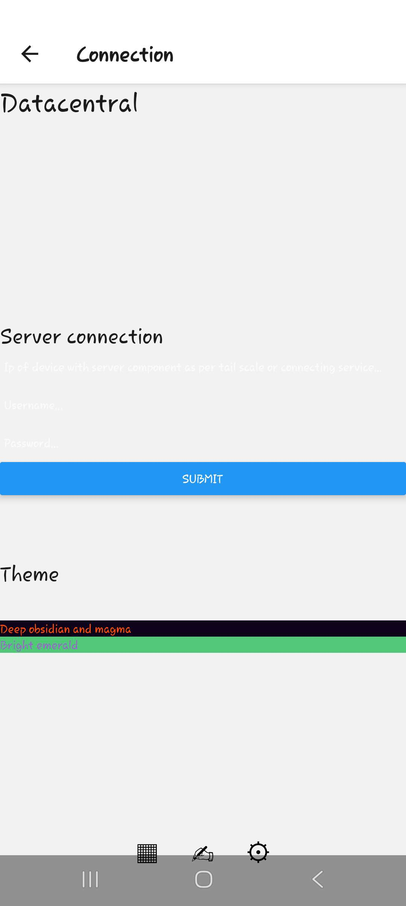
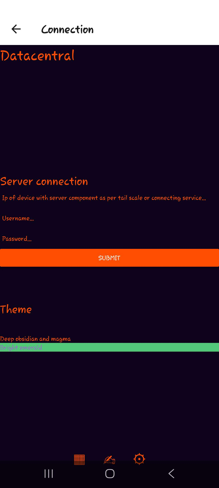
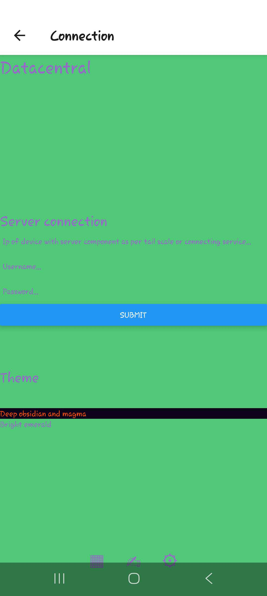
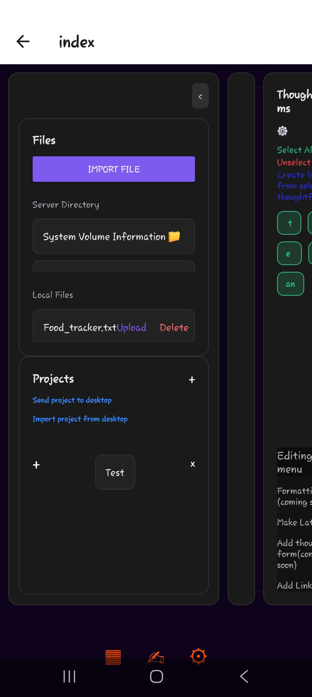
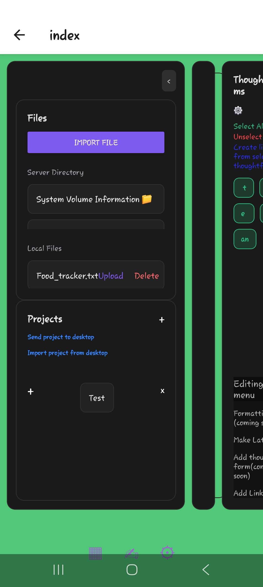
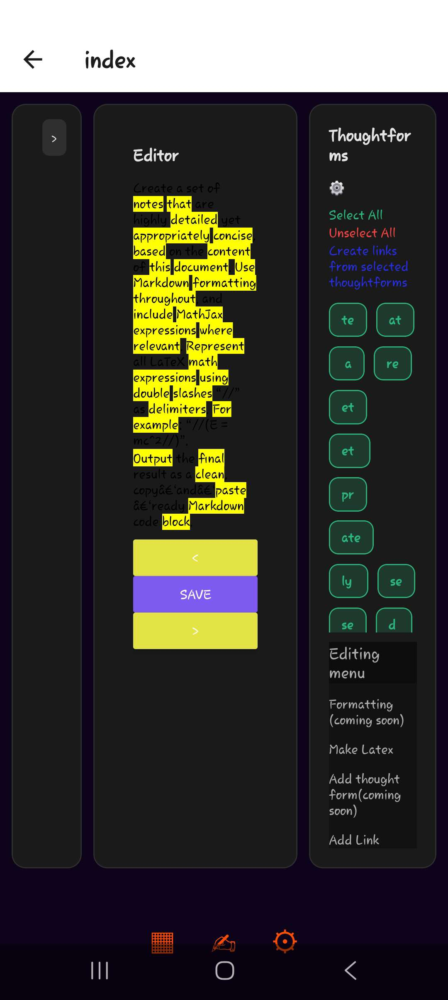
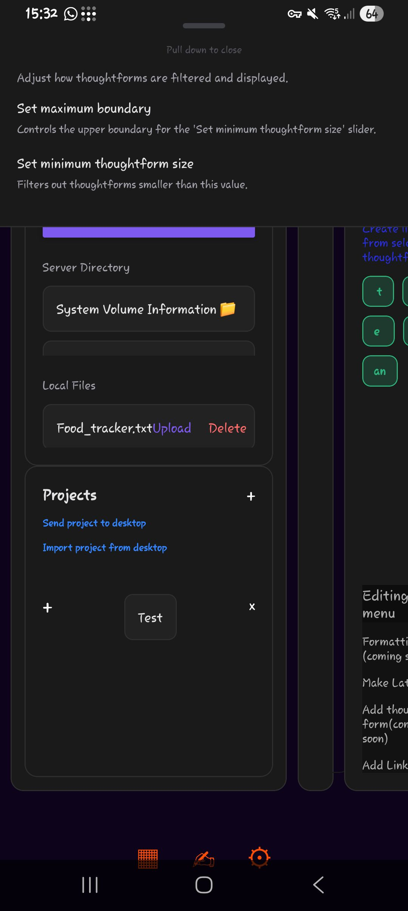

<h1>Datacentral installation</h1>
<h2>Desktop</h2>
<h3>Legacy</h3>
  <ol>
    <li>Clone this repo/download the files </li>
    <li>Download the add ons from <a href="https://drive.google.com/drive/folders/1cJYGMm6Aftqti8qN181DWwTC-rRK3Q2z?usp=drive_link">here</a> into the same directory as these files (legacy)</li>
    <li>Download the file <a href=https://drive.google.com/drive/folders/1FH03lHsV1SscCKU3DQOyHyDsb654SCWD?usp=sharing">"datacentral-1.0.0 Setup.exe"</a> into the same directory as the other files</li>
    <li>Run "Server.exe"</li>
    <li>Run the "datacentral-1.0.0 Setup.exe" file by clicking on it twice to open the GUI interface</li>
    <li>Choose "Configure network" if you wish to run datacentral on that computer or you can run Server.exe on one computer and run the GUI on another computer using "Connect to network"</li>
    <li>Create an account at localhost:3000 and create a pod called "poddy" to use the solid based add ons</li>
  </ol> 
<h3>Contemporary</h3>
<ol>
  <li>Clone this repo/download the files</li>
  <li>Run "main.exe" <-- Other files are add ons that can be installed from this file (It acts as a sort of package manager)</li>
</ol>
<h2>Mobile</h2>
<ol>
    <li>Download the app from <a href=https://drive.google.com/drive/folders/1ybxwCeh7UPWqyliDBnq135hPyD_FrkKH?usp=sharing>here</a></li>
    <li>Run the app</li>
</ol> 
<h3>If you want to connect it to the server component</h3>
<ol>
  <li>Install tailscale on your phone</li>
  <li>Sign in to the same network on your computer</li>
</ol>
<h1>Using the app</h1>
    

This is the home page which you will see when first opening the app

The first thing you should do is click the settings button which is the button at the bottom of the screen that looks like a cog or wheel

That should take you to this page

With magma theme

With emerald theme

Here, if you plan to connect the mobile app to the server component you should enter the ip of the device you are running the server component on on the tailscale network as well as the username and password you have entered into the server component on the file server in the section labelled "Server connection"

I would also strongly reccomend clicking a theme from "Deep obisidan and magma" or "Bright emerald" by clicking on the theme you wish to pick

Your changes will be initialised when you refresh the page by clicking on the settings button again or when you return to the home page

You can now return to the home page by clicking on the editor button which is the button that resembles a hand holding a pen at the bottom of the screen

This is what the home page will now look like:

Magma

Emerald

You can upload files either by clicking the "upload" button and uploading files from your phone, or waiting and the "Server directory" files menu will become populated with the files from the file server on the server component, clicking on one of these files will download it into your local files on the app (as well as uploading a file from your phone) 

You can click on a local file to interact with it

The screen below is a demonstration of this with an example file

The file loads in chunks. Everything you see on this page is one chunk. You can navigate the chunks using the arrows. You can also edit chunks freely however currently saving an edited chunk results in it being saved as it's own file (in the local files).

You will see on the side a menu saying "thoughtforms". Thoughtforms in the text files are symbols of sorts. They are the words the text is based around. The thoughtforms in the document you are editing are highlighted yellow by default. You can also filter thoughtforms by pressing the settings button in the thoughtform menu to filter the minimum length you will allow a thoughtform to be as shown below. 

Further reading(research/theoretical grounding): https://datacentral-creator.github.io/

